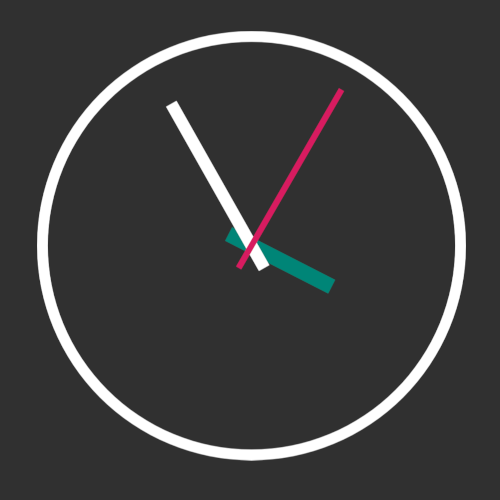

# simple-analog-clock 

[](https://jitpack.io/#leondzn/simple-analog-clock)

A simple clock view. The clock drawables can be changed with
your own custom assets.



## Prerequisites

Your project must be using AndroidX artifacts instead of Support Libraries. 
Otherwise your project build will fail due to `Manifest merger failed` error.

## Installation

```gradle
allprojects {
  repositories {
    ...
    maven { url 'https://jitpack.io' }
  }
}
```

```gradle
dependencies {
  implementation 'com.github.leondzn:simple-analog-clock:${version}'
}
```


## Usage

### XML
```xml
<com.leondzn.simpleanalogclock.SimpleAnalogClock
    android:id="@+id/clock"
    android:layout_width="match_parent"
    android:layout_height="match_parent"
    android:layout_margin="16dp"
    app:hourTint="@color/colorPrimary"                                        
    app:secondTint="@color/colorAccent" />
```

**The following XML attributes are supported:**

`app:faceTint, app:hourTint, app:minuteTint, app:secondTint`

to colorize the clock's face and hands.

You can manually set the individual hands' rotation value given a specific angle using

`app:hourRotation, app:minuteRotation, app:secondRotation`

You can also provide custom drawables for the clock using

`app:faceDrawable, app:hourDrawable, app:minuteDrawable, app:secondDrawable`

More info on providing custom drawables are detailed below.

### Java

```java
SimpleAnalogClock clock = findViewById(...);

clock.setSecondTint(...)
  .setTime(hour, minute, second);
```

You can rotate the clock hands individually using the following methods:

`rotateHourHand(angle), rotateMinuteHand(angle), rotateSecondHand(angle)`

Using the methods above requires you to calculate the corresponding angles for each time value.

To use exact time values, use the following methods:

`setTime(int hour, int minute, int second)` or `setTime(int hour, int munute, int second, int millis)`

Using the millisecond parameter allows for the second hand to turn more smoothly as opposed to traditional analog
clock "ticking" behavior.

Similar to the XML attributes, you can also provide custom drawables to use with the analog clock:

`setFaceDrawable(Drawable), setHourDrawable(Drawable), setMinuteDrawable(Drawable), setSecondDrawable(Drawable)`

## Using Custom Drawables

Simple default clock face and hands are provided but you are free to use custom drawables
provided that they follow these guidelines:

* All 4 layers (face, hour hand, minute hand, second hand) should all be the same image size
* The images should be square
* Clock hands should be pointing at the 12 o' clock position
* SVG or PNG can be used

**Example:**


Face


Short hand


Long hand


Second hand
